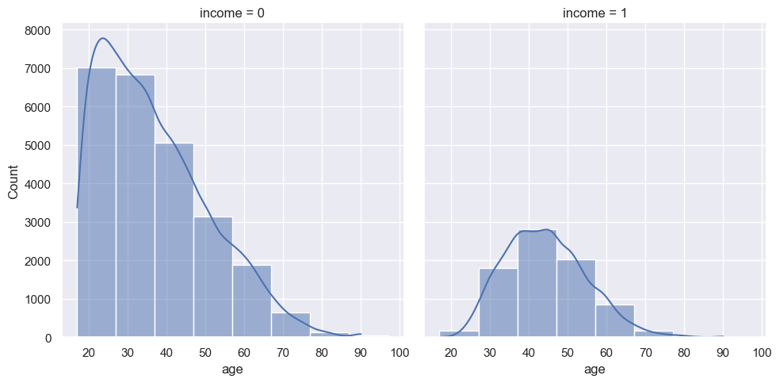
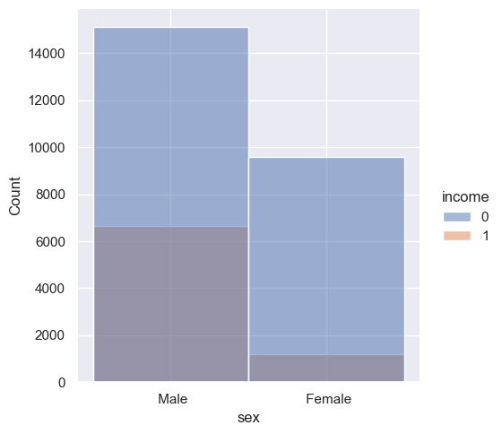
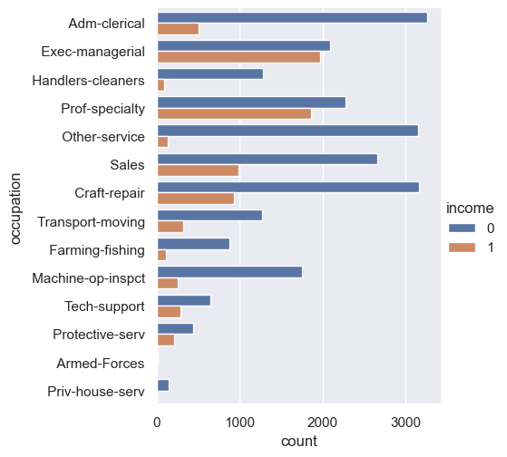
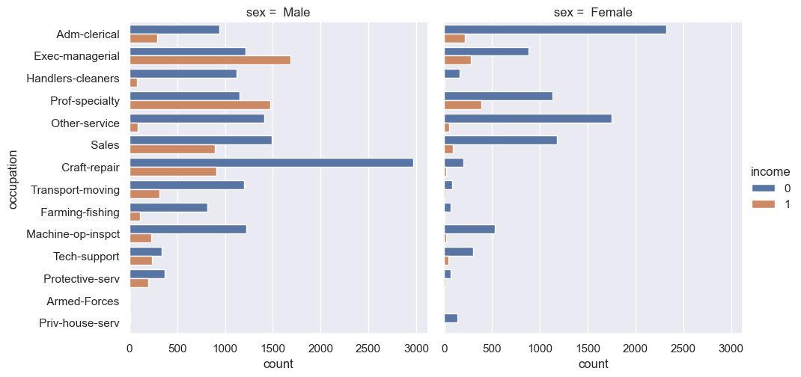

# Real-Estate-Client-Target

## Overview

The goal of this project is to help a real estate agency more effectively target potential clients by predicting which individuals earn more than $50K per year. Accurate income prediction will allow the agency to tailor its marketing strategies towards high-income clients, who are more likely to engage in high-value real estate transactions.

To achieve this, the project will use the [UCI Adult Dataset](https://archive.ics.uci.edu/dataset/2/adult), which includes various demographic and employment related attributes such as age, education, occupation, and hours worked per week. These features will be used to train a machine learning model that can classify individuals as either earning above or below $50K annually.

## Data Understanding

UCI Adult Dataset.

Predict whether income exceeds $50K/yr based on census data. Also known as "Census Income" dataset from UCI datasets. 

It comprises of:

1. 14 features
2. multivariate dataset  
3. categorical and integer feature type

## Insights

This project uses descriptive analysis in several forms to attempt to understand major success indicators that Real Estate industries uses to identify potentially useful strategies for a successful business.

### Findings

**Age Group**

Real Estate  agencies should focus with people between 40-60 years of ages.

**Gender**

Men hold top positions in their indurstries of work thus make them attain high income. However, this does not mean women shold be ignored at any point.

**Purpose_of_flight**

In matters towards income, occupation really matters. Top indurstrial positions make a higher income than other normal positions because they are the steers of respective indurstries.

Occupation based on Gender

## Conclusion

**Age Group**

Age groups tend to have a vital role towards income earned. The early age groups have a low income since they are newbies to the indurstry while the middle age groups have experience and are energetic in the work-place. 
Real Estate  agencies should focus with people between 40-60 years of ages.

**Gender**

Men hold top positions in their indurstries of work thus make them attain high income. However, this does not mean women shold be ignored at any point.

**Occupation**

In matters towards income, occupation really matters. Top indurstrial positions make a higher income than other normal positions because they are the steers of respective indurstries.

## For Inquiries, Business Proposals and Additional Information

The analysis process is available in this [notebook](https://github.com/kamahTek/Real-Estate-Client-Target/blob/master/real-estate.ipynb) and an [interactive tableau dashboard]()